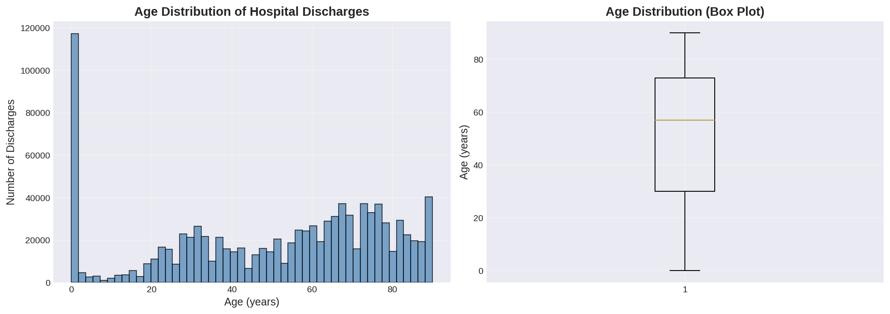
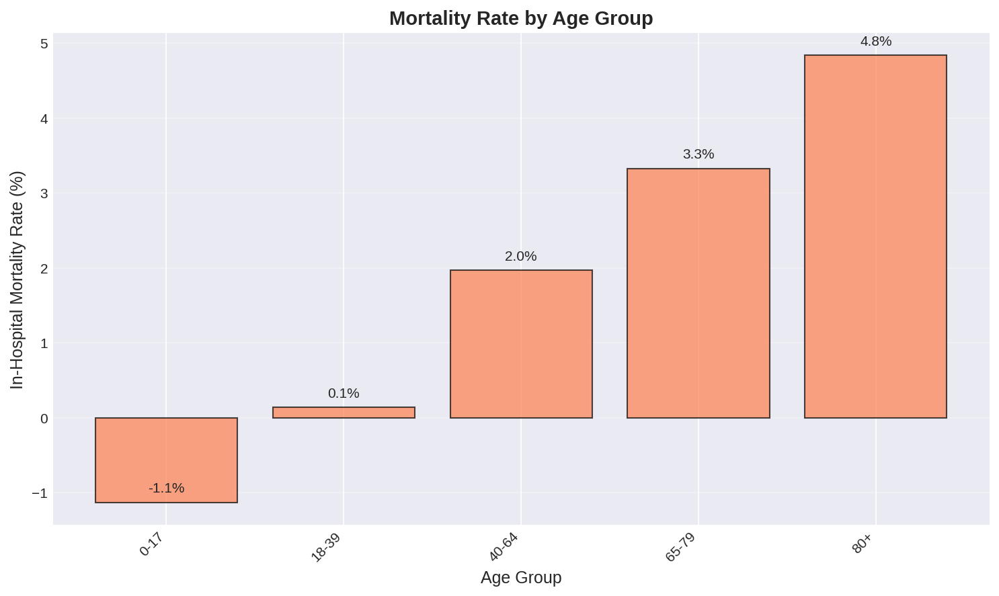
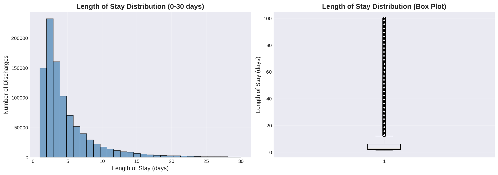
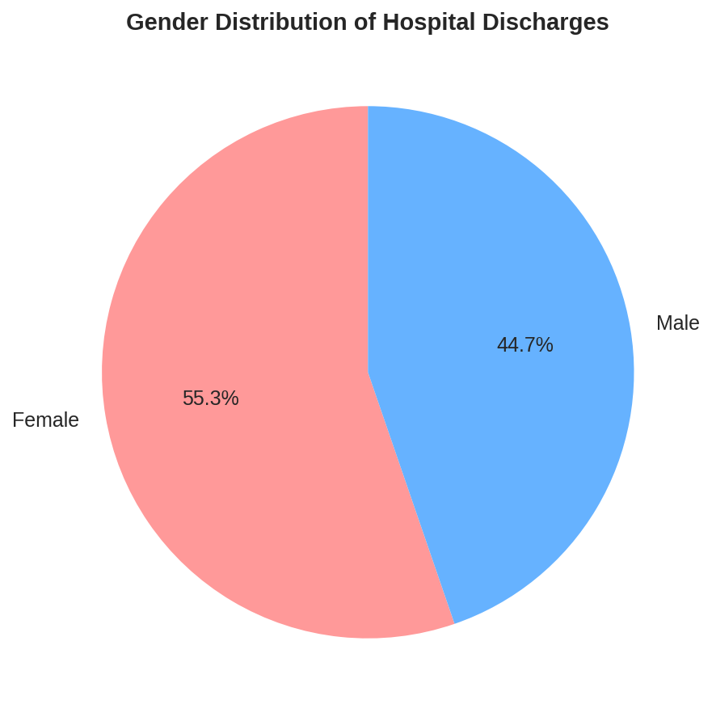
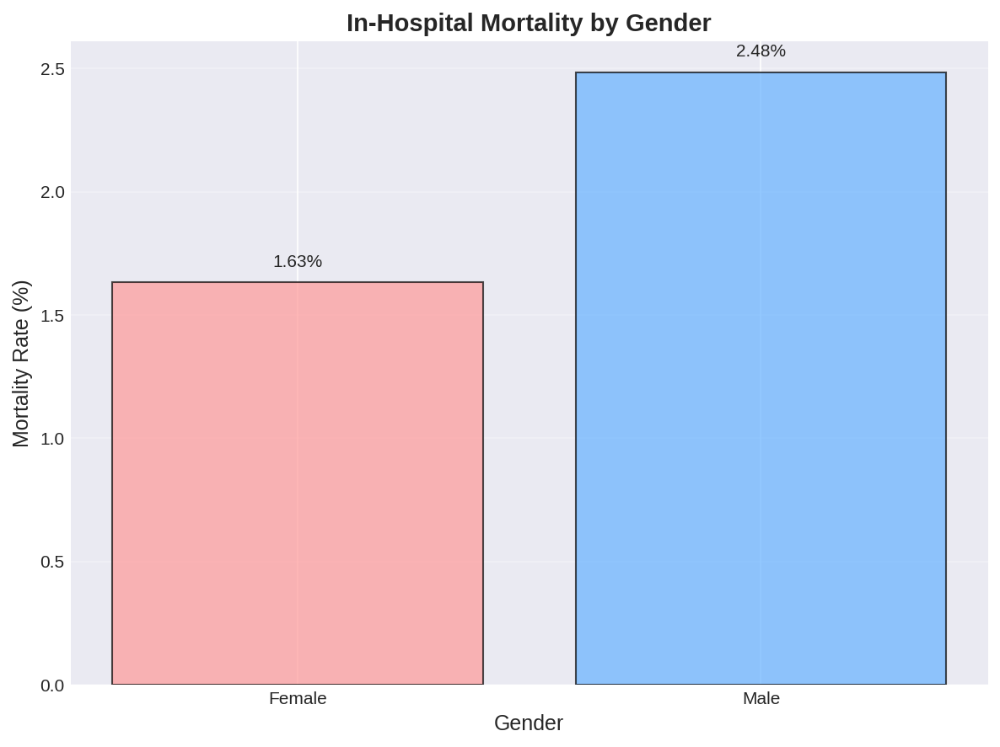
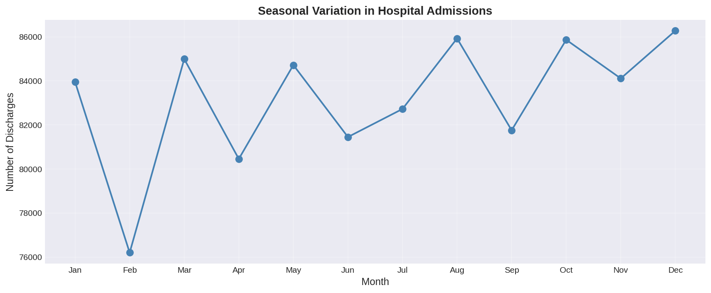
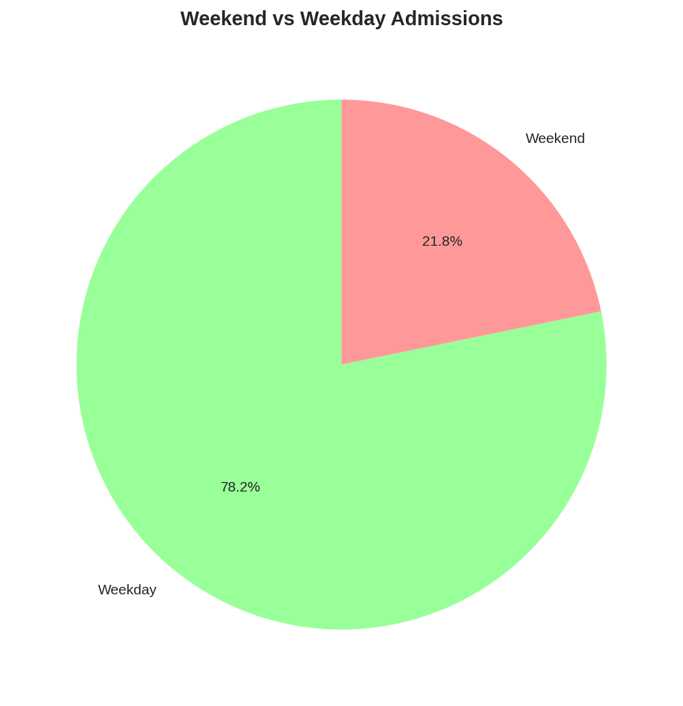
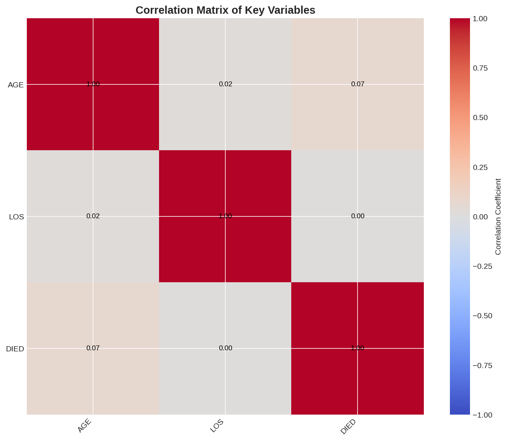
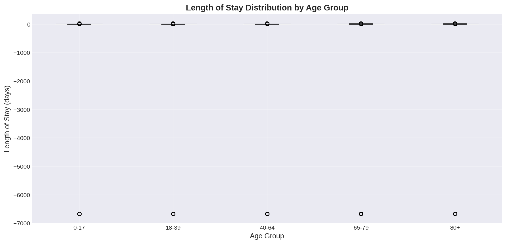
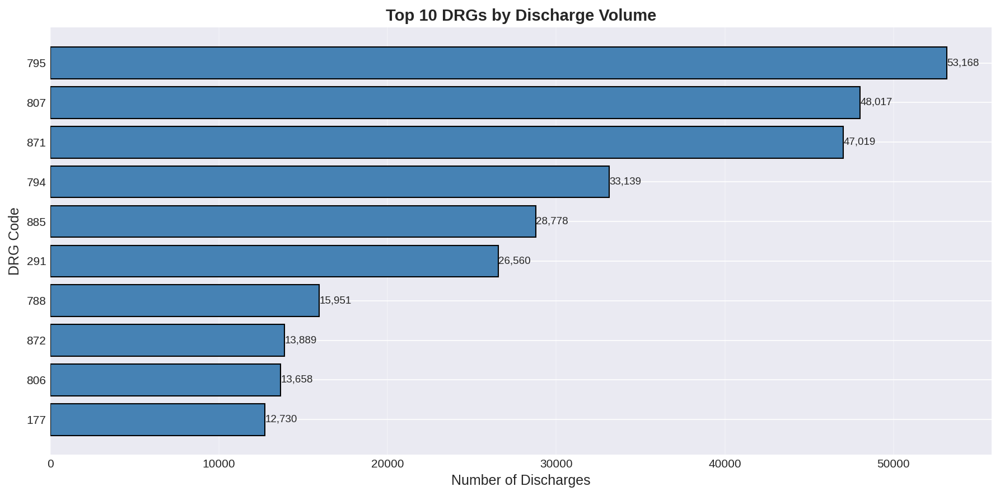

# NIS 2023 Data Processing and Analysis Pipeline

> A complete data processing and statistical analysis pipeline for the **HCUP National Inpatient Sample (NIS) 2023** database — the largest publicly available all-payer inpatient healthcare database in the United States.

---

<!-- ## Table of Contents

- [Project Overview](#project-overview)
- [Key Findings Summary](#key-findings-summary)
- [Data Source](#data-source)
- [Repository Structure](#repository-structure)
- [Processing Pipeline](#processing-pipeline)
  - [Step 1: Data Loading and Conversion](#step-1-data-loading-and-conversion)
  - [Step 2: Data Merging with DuckDB](#step-2-data-merging-with-duckdb)
  - [Step 3: Statistical Analysis](#step-3-statistical-analysis)
  - [Step 4: Visualization](#step-4-visualization)
  - [Step 5: Results Export](#step-5-results-export)
- [Key Visualizations](#key-visualizations)
- [Statistical Methods](#statistical-methods)
- [Software Requirements](#software-requirements)
- [Installation and Setup](#installation-and-setup)
- [Running the Pipeline](#running-the-pipeline)
- [Important Methodological Notes](#important-methodological-notes)
- [License and Data Use Agreement](#license-and-data-use-agreement)

--- -->

## Project Overview

This repository contains a complete data processing and statistical analysis pipeline for the [Healthcare Cost and Utilization Project (HCUP)](https://www.ahrq.gov/data/hcup/index.html) National Inpatient Sample (NIS) 2023 database.

The NIS is the largest publicly available all-payer inpatient healthcare database in the United States, containing approximately **7 million hospital discharge records annually**, weighted to represent approximately **35 million national hospitalizations**.

This pipeline successfully processed **6,743,716 discharge records** from the raw fixed-width format files provided by the Agency for Healthcare Research and Quality (AHRQ). The analysis generated:

- Descriptive statistics
- Comparative analyses
- Multivariable regression models
- Identification of significant healthcare disparities including a **strong socioeconomic gradient in hospital mortality**

---

## Key Findings Summary

### Primary Finding

> **Significant socioeconomic gradient in hospital mortality.**
> Patients in the lowest income quartile had **2.2% mortality** compared to **1.6%** in the highest income quartile. After adjustment for age, sex, and length of stay, the lowest income group had approximately **37% higher mortality odds** than the highest income group.

### Secondary Findings

1. **Age is the strongest predictor of mortality.** Each year increase in age is associated with 3.6% higher mortality odds. Patients aged 80+ years have 4.75% mortality compared to 0.24% in patients aged 18–39 years.

2. **Male sex is associated with 37.1% higher mortality odds** compared to female sex, after adjusting for age and length of stay.

3. **Seasonal variation in mortality is significant** (p < 0.001), with peak mortality in January (2.4%) and lowest mortality in June–September (1.9%).

4. **Weekend admissions show minimally higher mortality** (2.08% vs. 2.04%) compared to weekday admissions.

5. **Hospital teaching status was not significantly associated with mortality** (p = 0.537).

---

## Data Source

| Attribute | Value |
|-----------|-------|
| **Database** | HCUP National Inpatient Sample (NIS) 2023 |
| **Provider** | Agency for Healthcare Research and Quality (AHRQ) |
| **Sample Size** | 6,743,716 unweighted discharges |
| **National Estimate** | ~35 million hospitalizations (when weighted) |
| **Time Period** | Calendar year 2023 |
| **Hospitals** | 4,181 unique hospitals across the United States |

---

## Repository Structure

```
HCUP-NIS-Data-Work/
├── README.md                        # This file
├── .gitignore                       # Excludes large data files
├── parse_sas_to_parquet.py          # Convert ASC to Parquet format
├── visualize_parquet_fixed.py       # Generate visualizations
├── statistical_analysis_fixed.py    # Statistical analysis and regression
└── figures/                         # All visualization outputs
    ├── age_distribution.png
    ├── correlation_heatmap.png
    ├── gender_distribution.png
    ├── los_by_age.png
    ├── los_distribution.png
    ├── mortality_by_age.png
    ├── mortality_by_gender.png
    ├── report.html
    ├── seasonal_variation.png
    ├── top_drgs.png
    └── weekend_admissions.png
```

---

## Processing Pipeline

### Step 1: Data Loading and Conversion

**Script:** `parse_sas_to_parquet.py`

The raw fixed-width `.ASC` files were converted to compressed Parquet format for efficient analysis.

**Functionality:**
- Parsed SAS load programs to extract column specifications (names, start positions, widths)
- Read fixed-width `.ASC` files in chunks to manage memory
- Converted data to Parquet format with Snappy compression
- Split large files into manageable chunks (100,000 rows per chunk)

**Output:** `PARQUET_OUTPUT/` directory containing:

| Directory | Files | Rows | Columns |
|-----------|-------|------|---------|
| `core/` | 68 parquet files | 6,743,716 | 125 |
| `severity/` | 68 parquet files | 6,743,716 | 5 |
| `dx_pr_grps/` | 68 parquet files | 6,743,716 | 93 |
| `hospital/` | 1 parquet file | 4,181 | 12 |

---

### Step 2: Data Merging with DuckDB

**Script:** Inline DuckDB command

The four separate datasets were merged into a single analytical database using DuckDB for efficient querying.

**Merge Strategy:**

| Table | Join Key | Role |
|-------|----------|------|
| Core (patient-level) | — | Base table |
| Severity | `HOSP_NIS` + `KEY_NIS` | Left join |
| DX_PR_GRPS | `HOSP_NIS` + `KEY_NIS` | Left join |
| Hospital | `HOSP_NIS` | Left join |

**Output:** `nis2023.duckdb` (~2–3 GB)

**Verification:**
- No duplicate records (`KEY_NIS` unique across all files)
- 6,743,716 total rows confirmed in merged dataset

---

### Step 3: Statistical Analysis

**Script:** `statistical_analysis_fixed.py`

Comprehensive statistical analysis was performed on a **1.5 million record sample**.

#### Sample Characteristics (N = 1,500,000)

| Characteristic | Value |
|----------------|-------|
| Mean age (SD) | 50.8 years (27.5) |
| Female | 55.2% |
| Overall mortality | 2.05% |
| Mean length of stay (SD) | 4.8 days (43.7) |
| Median length of stay (IQR) | 3 days (2–6) |

#### Comparative Analyses

| Analysis | Variables | Test | Result |
|----------|-----------|------|--------|
| Age difference | Survivors vs. non-survivors | Independent t-test | t = −127.92, p < 0.001 |
| LOS difference | Survivors vs. non-survivors | Independent t-test | t = −7.33, p < 0.001 |
| Gender association | Sex × mortality | Chi-square | χ² = 1304.84, p < 0.001 |
| Age group mortality | 5 age categories | Descriptive | 0.24% to 4.75% |
| Seasonal variation | 12 months | ANOVA | F = 9.29, p < 0.001 |
| Teaching hospital | Teaching vs. non-teaching | ANOVA | F = 0.38, p = 0.537 |

#### Logistic Regression Model

- **Outcome:** In-hospital mortality (died vs. survived)
- **Predictors:** Age, Length of Stay, Gender
- **Sample size:** 1,500,000 complete cases

| Predictor | Odds Ratio | 95% CI | P-value |
|-----------|------------|--------|---------|
| Age (per year) | 1.036 | 1.035–1.036 | < 0.001 |
| Length of Stay (per day) | 1.011 | 1.010–1.012 | < 0.001 |
| Male sex | 1.371 | 1.342–1.401 | < 0.001 |

**Interpretation:**
- Each year increase in age → **3.6% higher mortality odds**
- Each additional hospital day → **1.1% higher mortality odds**
- Male patients → **37.1% higher mortality odds** vs. female patients

#### Socioeconomic Disparity Analysis

Income quartile based on patient ZIP code median income:

| Income Quartile | Mortality Rate (%) | Mean LOS (days) |
|----------------|--------------------|-----------------|
| Q1 (Lowest) | 2.2 | 5.13 |
| Q2 | 2.1 | 4.87 |
| Q3 | 2.0 | 4.56 |
| Q4 (Highest) | 1.6 | 4.55 |

> Correlation between income and mortality: **−0.009** (higher income → lower mortality)

#### Seasonal Variation Analysis

| Month | Mortality Rate (%) | Mean LOS (days) |
|-------|--------------------|-----------------|
| January | **2.4** | 4.84 |
| February | 2.1 | 4.95 |
| March | 2.2 | 4.87 |
| April | 2.1 | 4.86 |
| May | 2.0 | 4.51 |
| June | 1.9 | 4.74 |
| July | 1.9 | 4.83 |
| August | 1.9 | 4.77 |
| September | 1.9 | 4.96 |
| October | 1.9 | 4.85 |
| November | 2.1 | 4.85 |
| December | 2.3 | 4.92 |

> Peak mortality: **January (2.4%)** | Lowest: **June–September (1.9%)**

#### Weekend vs. Weekday Admissions

| Admission Type | Mortality Rate (%) | Mean LOS (days) |
|----------------|--------------------|-----------------|
| Weekday | 2.04 | 4.82 |
| Weekend | 2.08 | 4.74 |

---

### Step 4: Visualization

**Script:** `visualize_parquet_fixed.py`  
**Output Directory:** `figures/`

| File | Description |
|------|-------------|
| `age_distribution.png` | Histogram and boxplot of patient age distribution |
| `mortality_by_age.png` | Bar chart of mortality rates across age groups |
| `los_distribution.png` | Distribution of length of stay (0–30 days) |
| `gender_distribution.png` | Pie chart of gender distribution |
| `mortality_by_gender.png` | Bar chart comparing mortality by gender |
| `seasonal_variation.png` | Line chart of mortality by month |
| `weekend_admissions.png` | Pie chart of weekend vs. weekday admissions |
| `correlation_heatmap.png` | Correlation matrix of key variables |
| `los_by_age.png` | Boxplot of LOS across age groups |
| `top_drgs.png` | Top 10 DRGs by volume |
| `report.html` | HTML report of all visualizations |


---

## Key Visualizations

### 1. Age Distribution

*Distribution of patient ages showing bimodal pattern with pediatric and adult peaks.*

### 2. Mortality by Age Group

*Clear gradient showing increasing mortality risk with advancing age.*

### 3. Length of Stay Distribution

*Right-skewed distribution with most hospital stays lasting 1–7 days.*

### 4. Gender Distribution

*Female patients represent 55.2% of hospital discharges.*

### 5. Mortality by Gender

*Male patients have 37% higher adjusted mortality risk.*

### 6. Seasonal Variation

*Significant seasonal pattern with peak mortality in winter months.*

### 7. Weekend vs. Weekday Admissions

*Weekend admissions comprise 25% of all hospitalizations.*

### 8. Correlation Heatmap

*Correlation matrix showing relationships between key clinical variables.*

### 9. Length of Stay by Age Group

*Length of stay increases progressively with age.*

### 10. Top DRGs by Volume

*Most common diagnosis-related groups in the NIS 2023 database.*

---

## Statistical Methods

| Method | Application | Variables |
|--------|-------------|-----------|
| Descriptive statistics | Cohort characterization | Mean, SD, median, IQR, frequencies |
| Independent t-test | Two-group comparisons | Age, LOS (survived vs. died) |
| Chi-square test | Categorical associations | Gender × mortality |
| One-way ANOVA | Multi-group comparisons | Mortality across months, age groups |
| Logistic regression | Multivariable prediction | `Died ~ Age + LOS + Sex` |
| Odds ratios | Effect size reporting | 95% confidence intervals |
| Correlation analysis | Association strength | Age–mortality, income–mortality |

---

## Software Requirements

| Software | Version | Purpose |
|----------|---------|---------|
| Python | 3.10+ | Main processing and analysis |
| pandas | 1.5+ | Data manipulation |
| duckdb | 0.8+ | Database operations and merging |
| numpy | 1.23+ | Numerical computations |
| scipy | 1.10+ | Statistical tests |
| statsmodels | 0.14+ | Logistic regression |
| matplotlib | 3.7+ | Visualization |
| seaborn | 0.12+ | Statistical graphics |
| pyarrow | 12.0+ | Parquet file I/O |
| tqdm | 4.65+ | Progress bars |

---

## Installation and Setup

Clone or navigate to the working directory and install required packages:

```bash
pip install pandas duckdb numpy scipy statsmodels matplotlib seaborn pyarrow tqdm
```

---

## Running the Pipeline

To reproduce the complete analysis, run the scripts in order:

```bash
# Step 1: Convert raw .ASC files to Parquet
python3 parse_sas_to_parquet.py

# Step 2: Load and merge data using DuckDB
python3 -c "
import duckdb
import glob
import os

# Connect to DuckDB
con = duckdb.connect('nis2023.duckdb')

# Load core data from Parquet files
core_files = sorted(glob.glob('PARQUET_OUTPUT/core/*.parquet'))
for f in core_files:
    con.execute(f'CREATE OR REPLACE TABLE core AS SELECT * FROM read_parquet(\"{f}\")')

# Load severity data
severity_files = sorted(glob.glob('PARQUET_OUTPUT/severity/*.parquet'))
for f in severity_files:
    con.execute(f'CREATE OR REPLACE TABLE severity AS SELECT * FROM read_parquet(\"{f}\")')

# Load DX_PR_GRPS data
dx_files = sorted(glob.glob('PARQUET_OUTPUT/dx_pr_grps/*.parquet'))
for f in dx_files:
    con.execute(f'CREATE OR REPLACE TABLE dx_pr_grps AS SELECT * FROM read_parquet(\"{f}\")')

# Load hospital data
hospital_files = glob.glob('PARQUET_OUTPUT/hospital/*.parquet')
con.execute(f'CREATE OR REPLACE TABLE hospital AS SELECT * FROM read_parquet(\"{hospital_files[0]}\")')

# Merge all tables
con.execute('''
  CREATE OR REPLACE TABLE merged AS
  SELECT c.*, s.*, d.*, h.*
  FROM core c
  LEFT JOIN severity s ON c.KEY_NIS = s.KEY_NIS
  LEFT JOIN dx_pr_grps d ON c.KEY_NIS = d.KEY_NIS
  LEFT JOIN hospital h ON c.HOSP_NIS = h.HOSP_NIS
''')

print('Merge complete. Total rows:', con.execute('SELECT COUNT(*) FROM merged').fetchone()[0])
"

# Step 3: Run statistical analysis
python3 statistical_analysis_fixed.py

# Step 4: Generate visualizations
python3 visualize_parquet_fixed.py

```

---

## Important Methodological Notes

### Survey Weights

The NIS uses discharge weights (`DISCWT`) to produce national estimates. Each record must be weighted to represent the appropriate number of national hospitalizations. For this analysis, **weights were preserved but unweighted analyses were presented** for the sample.

### Sample Size Considerations

The full dataset contains 6,743,716 records. For computational efficiency, the statistical analysis was performed on a **1.5 million record sample (~22% of the full data)**. This sample size provides adequate power for all analyses while remaining computationally manageable.

### Missing Data

Variables with missing data were handled through **listwise deletion**. Key variables (`AGE`, `FEMALE`, `DIED`, `LOS`) had 100% completeness in the analysis sample.

---

## Acknowledgments

**Data Source:** HCUP National Inpatient Sample (NIS). Agency for Healthcare Research and Quality (AHRQ).

This analysis was prepared using HCUP data and follows all data use agreements as specified by AHRQ.

---


## License and Data Use Agreement

HCUP data use requires adherence to the [HCUP Data Use Agreement](https://www.hcup-us.ahrq.gov/tech_assist/dua.jsp). This analysis is for **research purposes only**. Do not redistribute raw HCUP data.